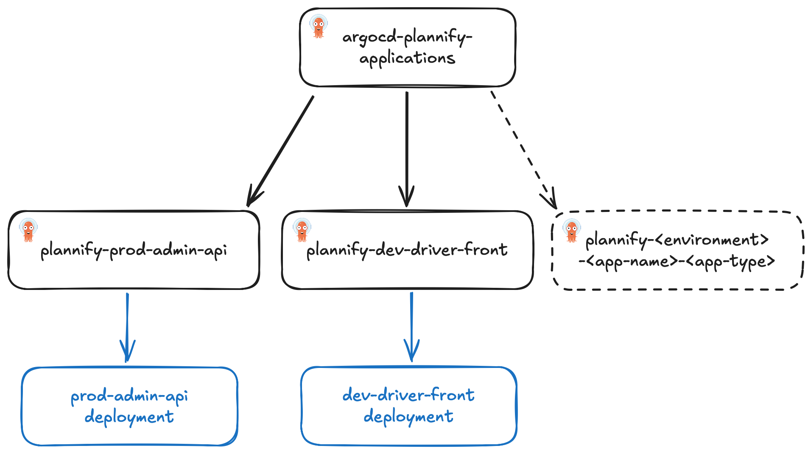

# Plannify Infrastructure

This repository contains the infrastructure as code (IaC) for the Plannify application using Kubernetes manifests.

## Directory Structure

- `argocd-applications/`: Contains ArgoCD application definitions for deploying Plannify applications.
- `secrets-template/`: Contains templates for Kubernetes Secrets used in the Plannify application.
- `yaml-applications/`: Contains Kubernetes deployment, service and ingress definitions for Plannify applications.

## ArgoCD Structure

All ArgoCD applications are defined in the `argocd-applications/` directory. In `argocd-applications/apps`, each application has its own file that defines the ArgoCD application, including its source, destination, and sync policy.

Each ArgoCD application files are named `<environment>-<app-name>-<app-type>.yaml`, where `<app-name>` is the name of the application and `<app-type>` is the type of the application (e.g., `api` or `frontend`).
Except for `argocd-applications/argocd.yaml`, which is the main ArgoCD application that deploys all other ArgoCD applications.



## Manual Deployment

The `secrets-template/` folder contains templates for Kubernetes Secrets used in the Plannify application. You can copy this directory to create your own secrets directory.

```bash
cp -r secrets-template/ secrets/
```

Update the secrets in the `secrets/` directory and apply them to the cluster manually using `kubectl`.

```bash
kubectl apply -f secrets/
```